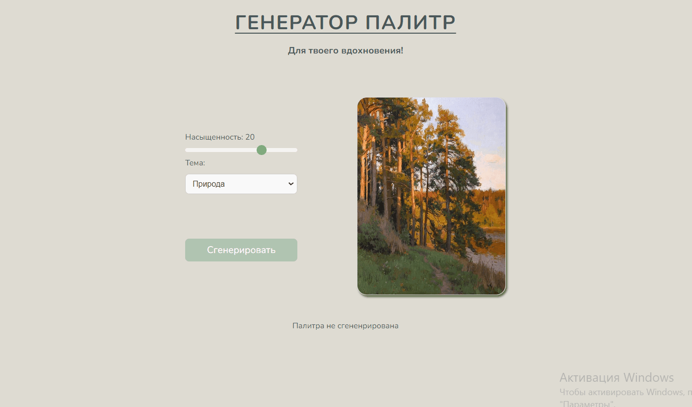

# 🎨 Palette Generator - Генератор Палитр
Проект на React + Vite с использованием Styled Components 

## Описание проекта

**Генератор палитр** — это веб-приложение, ориентированное на художников и дизайнеров. Оно предлагает уникальные цветовые палитры, основанные на этюдах. Приложение помогает ориентироваться по основной цветовой палитре при создании картин и служит источником вдохновения для художественного творчества. Пользователи могут генерировать палитры, сохранять их hex-код, создавая гармоничные цветовые схемы для своих художественных проектов.

## Основной функционал

- **🔲 Генерация случайных палитр**: Создание палитр на основе выбранной темы.
- **🎨Изменение насыщенности**: Возможность вручную изменять насыщенность цвета в палитре.
- **💾Копирование цвета**: Возможность при наведении скопировать сгененированый цвет.

